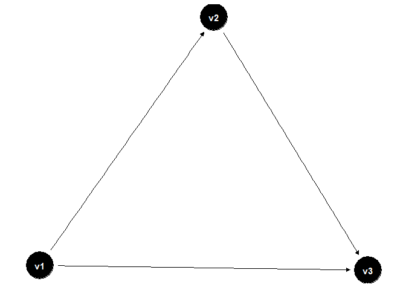
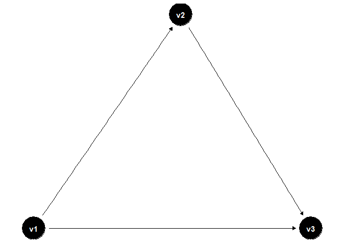

```r
knitr::opts_chunk$set(echo = TRUE)

library(dagitty)
library(ggdag)
library(stringr)
library(devtools)

source_url("https://github.com/rasmusklokker/copydagitty/blob/main/copydagitty_function.R?raw=TRUE")
```

## copydagitty function

Using the GUI of dagitty.net is a really nice way of sketching up a DAG. Unfortunately, the model code supplied by dagitty.net dosn't play too well with packages like "ggdag", which is annoying if you want to continue working on your dag in R, but would like to copy-paste information like the coordinates of the nodes. For that reason i hacked together this function.

First you'll have to do a bit of manual work(mainly because i didn't get around to have R read the clipboard. I was lazy and i am sorry.)

First you copy-paste the model code from dagitty.net, which could look like this:

dag {<br />
bb="0,0,1,1"<br />
v1 [exposure,pos="0.181,0.401"]<br />
v2 [pos="0.327,0.242"]<br />
v3 [outcome,pos="0.456,0.404"]<br />
v1 -> v2<br />
v1 -> v3<br />
v2 -> v3<br />
}

This will not work as an input to the function, so you'll have to delete the quotes(just use ctrl+f if you work in Rstudio), and encapsulate the model code in quotes after that, and it will look like this:


```r
dag.raw <- "dag {
  bb=0,0,1,1
  v1 [exposure,pos=0.181,0.401]
  v2 [pos=0.327,0.242]
  v3 [outcome,pos=0.456,0.404]
  v1 -> v2
  v1 -> v3
  v2 -> v3
}"
```

## using the function

Now you just put the dag object in the function, and we got ourselves something that ggdag will read.


```r
dag <- copydagitty(dag.raw, autoalign = FALSE)

p <- ggdag(dag) + scale_y_reverse()+theme_dag() #dagitty.net and ggdag have reverse scales on the y-axis, hence the scale_y_reverse()
p
```

<!-- -->

You may notice that the nodes v1 and v3 aren't too well aligned on the x-axis, which is 100% due my poor hand-eye coordination while i drew up the DAG on dagitty.net. If you also experience problems with aligning nodes perfectly, there's an option to autoalign nodes. Basically it goes though the coordinates of each pair of nodes and computes the difference in coordinates on each axis. If the difference in coordinates on one of the axes is within the tolerance limit(0.01 is the default), the coordinates of the nodes will be set to the same value. 


```r
dag.align <- dag <- copydagitty(dag.raw, autoalign = TRUE, autoalign.tol=0.01)

p <- ggdag(dag.align) + scale_y_reverse()+theme_dag()
p
```

<!-- -->

There, much better!!

Enjoy(i hope)! 
